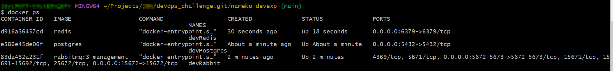
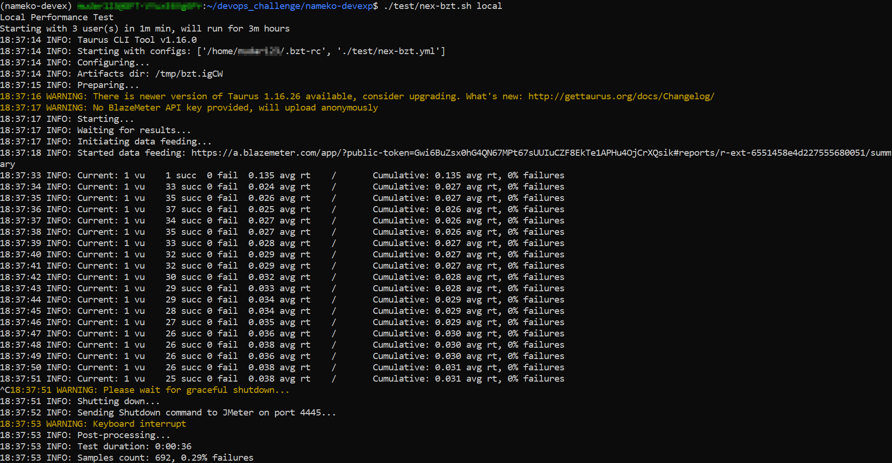

# DevOps_Challenge

This document/repository approaches my journey through the challenge propose by [Ilia](https://ilia.digital/en/).
The challenge can be consulted [here](challenge_description/DevOps_Engineer_-_Case_Study.pdf).

## Fist of all

I read the entire documentation attached at [challenge doc](challenge_description/DevOps_Engineer_-_Case_Study.pdf) and I studied tools and concepts like:
 - [twelve-factor app](https://12factor.net/)
 - [nameko utilization](https://blog.geekhunter.com.br/python-microservices/)
 - [Miniconda](https://docs.conda.io/projects/conda/en/latest/user-guide/concepts/environments.html)
 - [how-to-build-microservices-with-nameko](https://www.coditation.com/blog/how-to-build-microservices-with-nameko)
 - [k3d_install](https://k3d.io/v5.6.0/#installation)
 - [epinio_install](https://docs.epinio.io/installation/other_inst_scenarios/install_epinio_on_k3d)
 - [epinio_manifests](https://docs.epinio.io/references/manifests)
 - [epinio_push_details](https://docs.epinio.io/explanations/detailed-push-process)
 - [epinio_advanced_topics](https://docs.epinio.io/explanations/advanced)
 - [epinio_services(bind)](https://docs.epinio.io/references/services)

NOTE: I changed the format of that topic because the list of tools and concepts was growing while I was going deep in the challenge :D.

## Hands ON

### Exercise 01 - [Challenge](challenge_description/DevOps_Engineer_-_Case_Study.pdf)

I'm creating the setup for nameko, I'm just following the HowTo from the [gitlab README](https://gitlab.com/devprodexp/nameko-devexp/-/blob/main/README-DevEnv.md).

NOTES about pre-requisites:

    1 - I fell more confortable using PyCharm instead VSCode.
    2 - I used chocolatey instead brew, It was already installed on my computer.

#### **nameko-devexp clone**

Run command `git clone https://gitlab.com/devprodexp/nameko-devexp.git` 

#### **'jq' Instalation** 

Run command `brew install jq` or `choco install jq`

#### **Conda Environment Instalation** 

Open Anaconda Prompt.

On Linux I needed run this command to active the environment: `source <home_miniconda3>/etc/profile.d/conda.sh`

Run command `conda env create -f environment_dev.yml`

Returned an error because my conda was seted to python version 3.11

The error was about installation of the package _fuzzyset_, I found on Google, the _fuzzyset_ package is in package _bzt_ in the dependency section at [environment_dev.yml](nameko-devexp/environment_dev.yml). So I updated the _bzt_ package version. The problem was solved and the Conda environment was created.

Environment Created.

#### **Conda Environment Activation** 

Run command `conda activate nameko-devex`

#### **Start Service Locally** 

To start backend nameko-devexp services run script in nameko-devexp `./dev_run_backingsvcs.sh`

NOTE: Because of startup services scripts I changed the environment to a Linux OS, before I was using Microsoft Windows 10. I executed all past steps described in this document, and everything ran the same. 

Continuing on Linux...

To start nameko services run script in nameko-devexp `./dev_run.sh gateway.service orders.service products.service`

To run smoke test execute the command `./test/nex-smoketest.sh local`

To run unit test execute the command `./dev_pytest.sh`

To run in debug mode execute the command `DEBUG=1 ./dev_run.sh gateway.service orders.service products.service`

To run in performance test execute the command `./test/nex-bzt.sh local`

Link to Result: https://a.blazemeter.com/app/?public-token=Gwi6BuZsx0hG4QN67MPt67sUUIuCZF8EkTe1APHu4OjCrXQsik#reports/r-ext-6551458e4d227555680051/summary

[Performance Test Result Artifacts](performanceTestResult)

Running FastAPI integration with nameko in that case we don't need run gateway.service, it is replaced by gateapi, command: `FASTAPI=X ./dev_run.sh orders.service products.service`

Swagger WebAccess running FastAPI.

### Exercise 02 - [Challenge](challenge_description/DevOps_Engineer_-_Case_Study.pdf)

The Epinio will be installed using K3D and docker, the K3D install will be done following the [K3D_Install_Instruction.](https://k3d.io/v5.6.0/#installation)

#### **K3D Install:**

    - wget -q -O - https://raw.githubusercontent.com/k3d-io/k3d/main/install.sh | bash
    - k3d cluster create epinio
    - kubectl cluster-info
    - kubectl get nodes

#### **Epinio Install:**

Install Traefik Ingress-Controller:

    - kubectl create ns traefik
    - helm install traefik traefik/traefik --namespace traefik

Install Cert-Manager:
    
    - helm repo add jetstack https://charts.jetstack.io
    - helm repo update
    - helm upgrade --install cert-manager jetstack/cert-manager --namespace cert-manager  \
        --set installCRDs=true \
        --set extraArgs={--enable-certificate-owner-ref=true} \
        --create-namespace   

Install Epinio
    
    - helm repo add epinio https://epinio.github.io/helm-charts
    - helm repo update
    - helm upgrade --install epinio epinio/epinio \
        --namespace epinio --create-namespace \
        --set global.domain="<EXTERNAL-IP>.sslip.io"

Install Epinio CLI

    - brew install epinio

Epinio Login

    - epinio login -u admin 'https://epinio.<INTERNAL-IP>.sslip.io'

Epinio Sample Install

    - git clone https://github.com/epinio/epinio.git
    - cd epinio/assets/
    - epinio push --name sample --path sample-app

Epinio Sample Test/Return

### Exercise 03 - [Challenge](challenge_description/DevOps_Engineer_-_Case_Study.pdf)

**Prepare Environment**

Epinio Login

`epinio login -u admin https://epinio.<INTERNAL_IP>.sslip.io`

**NOTE:** My WSL environment is not so good then I'm creating a new test environment in a Linux VM Instance.

In the process os create a new environment using a Linux VM Instance, I started to create a [setup_script](automation_setup/setup.sh) for prepare the machine and I'm trying deploy nameko microservices successfully
 and I'm testing new epinio concepts to do these nameko application deployments. For example, creating an Epinio manifest.

**Run Application Push**

After Epinio Login, push application using the command:

`epinio push -n <application-name>`

.
.
.

Nameko Applications Running on Cluster with error

To solve it, we will bind services rabbitMQ, redis and postgresql to nameko app deployment

List services catalog:

`epinio service catalog`

Create services dependencies for nameko-app (postgresql, rabbitmq and redis):

`epinio service create postgresql-dev devPostgres`

`epinio service create rabbitmq-dev devRabbit`

`epinio service create redis-dev devRedis`

Show Services Created:

`epinio service show devPostgres`

`epinio service show devRabbit`

`epinio service show devRedis`

Bind the services to nameko-app:

`epinio service bind devPostgres nameko`

`epinio service bind devRabbit nameko`

`epinio service bind devRedis nameko`

**Running Application Tests**

